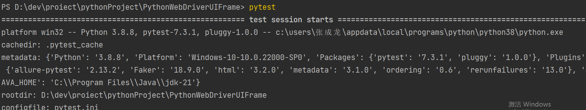
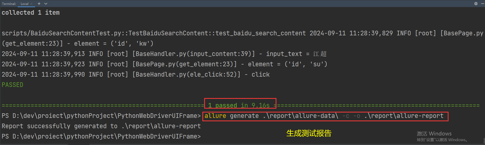
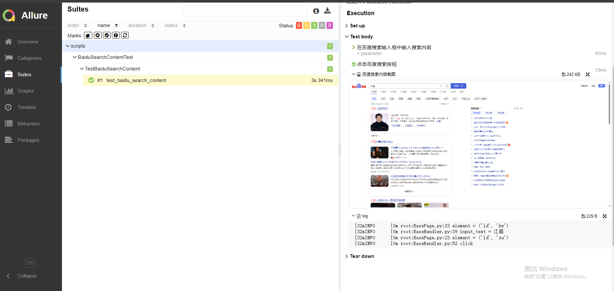

# Python + Selenium + Pytest + Allure

Gitee框架地址：https://gitee.com/kang-kang520/PythonWebDriverUIFrame

手把手框架搭建教学地址：https://www.bilibili.com/video/BV11c411U7uk/?spm_id_from=333.788&vd_source=041bc3fc775a34d6d411f01365cecd96

### 技术栈

- Python + Selenium + pytest + Allure

### 设计模式

- POM + Spring MVC 结合设计模式

### 代理

浏览器驱动代理：webdriver_manager

无需浏览器镜像，自动检测并下载代理镜像 

安装方式：pip install webdriver_manager

For now support:
- ChromeDriver
- GeckoDriver
- IEDriver
- OperaDriver
- EdgeChromiumDriver

#### 代理方式

#### Use with Chrome

```python3
# selenium 3
from selenium import webdriver
from webdriver_manager.chrome import ChromeDriverManager

driver = webdriver.Chrome(ChromeDriverManager().install())

```

```python
# selenium 4
from selenium import webdriver
from selenium.webdriver.chrome.service import Service as ChromeService
from webdriver_manager.chrome import ChromeDriverManager

driver = webdriver.Chrome(service=ChromeService(ChromeDriverManager().install()))
```


#### Use with Chromium

```python3
# selenium 3
from selenium import webdriver
from webdriver_manager.chrome import ChromeDriverManager
from webdriver_manager.core.os_manager import ChromeType

driver = webdriver.Chrome(ChromeDriverManager(chrome_type=ChromeType.CHROMIUM).install())

```

```python
# selenium 4
from selenium import webdriver
from selenium.webdriver.chrome.service import Service as ChromiumService
from webdriver_manager.chrome import ChromeDriverManager
from webdriver_manager.core.os_manager import ChromeType

driver = webdriver.Chrome(service=ChromiumService(ChromeDriverManager(chrome_type=ChromeType.CHROMIUM).install()))
```


#### Use with Brave

```python3
# selenium 3
from selenium import webdriver
from webdriver_manager.chrome import ChromeDriverManager
from webdriver_manager.core.os_manager import ChromeType

driver = webdriver.Chrome(ChromeDriverManager(chrome_type=ChromeType.BRAVE).install())

```

```python
# selenium 4
from selenium import webdriver
from selenium.webdriver.chrome.service import Service as BraveService
from webdriver_manager.chrome import ChromeDriverManager
from webdriver_manager.core.os_manager import ChromeType

driver = webdriver.Chrome(service=BraveService(ChromeDriverManager(chrome_type=ChromeType.BRAVE).install()))
```


#### Use with Edge

```python3
# selenium 3
from selenium import webdriver
from webdriver_manager.microsoft import EdgeChromiumDriverManager

driver = webdriver.Edge(EdgeChromiumDriverManager().install())

```

```python
# selenium 4
from selenium import webdriver
from selenium.webdriver.edge.service import Service as EdgeService
from webdriver_manager.microsoft import EdgeChromiumDriverManager

driver = webdriver.Edge(service=EdgeService(EdgeChromiumDriverManager().install()))
```


#### Use with Firefox

```python3
# selenium 3
from selenium import webdriver
from webdriver_manager.firefox import GeckoDriverManager

driver = webdriver.Firefox(executable_path=GeckoDriverManager().install())

```

```python
# selenium 4
from selenium import webdriver
from selenium.webdriver.firefox.service import Service as FirefoxService
from webdriver_manager.firefox import GeckoDriverManager

driver = webdriver.Firefox(service=FirefoxService(GeckoDriverManager().install()))
```


#### Use with IE

```python3
# selenium 3
from selenium import webdriver
from webdriver_manager.microsoft import IEDriverManager

driver = webdriver.Ie(IEDriverManager().install())

```

```python
# selenium 4
from selenium import webdriver
from selenium.webdriver.ie.service import Service as IEService
from webdriver_manager.microsoft import IEDriverManager

driver = webdriver.Ie(service=IEService(IEDriverManager().install()))
```


#### Use with Opera

```python3
# selenium 3
from selenium import webdriver
from selenium.webdriver.chrome import service
from webdriver_manager.opera import OperaDriverManager

webdriver_service = service.Service(OperaDriverManager().install())
webdriver_service.start()

driver = webdriver.Remote(webdriver_service.service_url, webdriver.DesiredCapabilities.OPERA)

```

```python
# selenium 4
from selenium import webdriver
from selenium.webdriver.chrome import service
from webdriver_manager.opera import OperaDriverManager

webdriver_service = service.Service(OperaDriverManager().install())
webdriver_service.start()

options = webdriver.ChromeOptions()
options.add_experimental_option('w3c', True)

driver = webdriver.Remote(webdriver_service.service_url, options=options)
```

### 项目目录结构

- api：存放于系统 url 地址
- base：存放于 页面元素层基类 元素操作层基类
- data：存放构造数据文件
- log：存放系统日志
- pages：存放页面元素、操作、业务处理
  - elepages：页面元素层
    - elepagesimpl：页面元素实现层
  - handlerpages：页面操作层
  - proxypages：业务逻辑处理层
- report：测试报告(在运行脚本的时候会自动生成次目录)
- scripts：测试脚本
- utils： 工具类
- .env：环境、密码存放位置
- conftest：系统配置文件
- pytest.ini：pytest配置文件


### pytest.ini

pytest.ini 文件简单示例：

```plaintext
[pytest]
addopts= --alluredir reports/allure-data --reruns 2 -p no:warnings
testpaths= ./testcases
python_files = *es*.py
python_classes = Test*
```

解释pytest参数

```plaintext
[pytest]
addopts= 这个是终端运行命令预处理携带参数，当输入pytest命令时，会自动携带此参数
testpaths= 这个是需要运行的测试用例路径
python_files = 这个是需要运行的python测试文件
python_classes = 这个是需要运行的测试类
```

备注：
 pytest.ini 示例文件当中，addopts中的参数 --reruns 2 是失败重跑的意思； 需要下载第三方插件：pytest-ordering
 -p no:warnings：是去除多余的警告信息
 您可以在配置文件当中写好配置，或者在终端命令中携带此参数即可

pytest官方文档：https://docs.pytest.org/en/8.0.x/

### 终端运行

直接运行pytest即可







